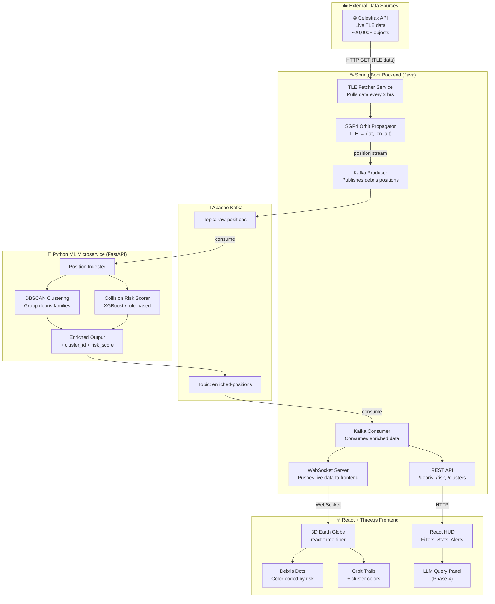

# 🛰️ Space Debris Visualization — Full System Architecture

## Overview

A full-stack, real-time space debris tracking and visualization system with AI/ML-powered collision risk prediction and orbital clustering.

---

## System Architecture Diagram



---

## Component Breakdown

### 1. 🌐 External Data — Celestrak API
| Detail | Value |
|---|---|
| URL | `https://celestrak.org/SOCRATES/` or GP data |
| Format | **TLE (Two-Line Element)** sets |
| Refresh | Every 2 hours (TLEs are stable for days) |
| Object count | ~20,000+ trackable objects |
| Cost | Free, no API key needed |

---

### 2. ☕ Spring Boot Backend (Java)

| Service | Responsibility |
|---|---|
| `TLEFetcherService` | HTTP GET from Celestrak, scheduled every 2hrs |
| `SGP4PropagatorService` | Convert TLE → real-time (lat, lon, altitude) using SGP4 math |
| `KafkaProducerService` | Publish raw positions to Kafka topic `raw-positions` |
| `KafkaConsumerService` | Consume enriched data from `enriched-positions` |
| `WebSocketService` | Push live debris positions to all connected frontend clients |
| `REST Controllers` | `/api/debris` · `/api/risk` · `/api/clusters` |

> **SGP4** is the standard algorithm used by NORAD to propagate orbital elements. A Java library like [orekit](https://www.orekit.org/) can handle this.

---

### 3. 📨 Apache Kafka

| Topic | Producer | Consumer | Payload |
|---|---|---|---|
| `raw-positions` | Spring Boot | Python ML service | `{id, lat, lon, alt, epoch}` |
| `enriched-positions` | Python ML service | Spring Boot | `{id, lat, lon, alt, cluster_id, risk_score, risk_level}` |

---

### 4. 🐍 Python ML Microservice (FastAPI)

| Module | Algorithm | Output |
|---|---|---|
| **Debris Clustering** | DBSCAN on (inclination, RAAN, altitude) | `cluster_id` per object |
| **Collision Risk Scorer** | XGBoost / rule-based (closest approach distance) | `risk_score` 0–1, `risk_level` LOW/MED/HIGH |

**Flow:**
1. Consumes from `raw-positions` Kafka topic
2. Runs DBSCAN clustering on the current batch
3. Computes pairwise closest approach for high-density regions
4. Publishes enriched data to `enriched-positions`

**Stack:** `FastAPI` · `confluent-kafka` · `scikit-learn` · `numpy` · `sgp4` (Python lib)

---

### 5. ⚛️ React + Three.js Frontend

| Component | Library | Role |
|---|---|---|
| `EarthGlobe` | `@react-three/fiber` + `drei` | 3D Earth with atmosphere shader |
| `DebrisDots` | Three.js `Points` / `Instanced Mesh` | Render 20k+ debris as colored dots |
| `OrbitTrails` | Three.js `Line` | Show predicted orbital path |
| `RiskHighlight` | Three.js + React state | Red glow for HIGH risk objects |
| `ClusterColors` | Three.js vertex colors | Color debris families differently |
| React HUD | Plain React | Filters, stats panel, risk alerts |
| LLM Query Panel | Gemini/OpenAI API | Natural language queries *(Phase 4)* |

**WebSocket** — frontend connects to Spring Boot WS endpoint, receives live JSON updates every 5 seconds and re-renders debris positions.

---

## Tech Stack Summary

| Layer | Technology |
|---|---|
| Frontend | React 18, react-three-fiber, @react-three/drei, Zustand |
| 3D Rendering | Three.js |
| Backend | Java 17, Spring Boot 3, Spring Kafka, Spring WebSocket |
| Streaming | Apache Kafka |
| ML Service | Python 3.11, FastAPI, scikit-learn, confluent-kafka, sgp4 |
| Data Source | Celestrak (free TLE API) |
| Orbit Math | Orekit (Java) / sgp4 (Python) |
| Build | Maven (Java), pip/poetry (Python), Vite (React) |

---

## Phased Build Plan

```
Phase 1 — Visualization Foundation
  ✅ React + Three.js 3D Earth globe (mock data)
  ✅ Debris dots rendering (lat/lon → 3D sphere coords)
  ✅ Orbit trail lines

Phase 2 — Backend Pipeline
  ✅ Spring Boot TLE fetcher (Celestrak)
  ✅ SGP4 propagation (Orekit)
  ✅ Kafka producer + WebSocket to frontend
  ✅ Replace mock data with live positions

Phase 3 — ML Layer
  ✅ Python FastAPI microservice
  ✅ DBSCAN clustering → cluster colors on globe
  ✅ Collision risk scoring → risk heatmap + alerts

Phase 4 — Polish & AI UX
  ✅ LLM Natural Language Query panel
  ✅ Orbital decay countdown timer
  ✅ Anomaly detection alerts
```

---

## Data Flow (End to End)

```
Celestrak TLE
    ↓  (every 2 hrs)
Spring Boot TLEFetcherService
    ↓  SGP4 propagation
{id, lat, lon, altitude}
    ↓  Kafka: raw-positions
Python ML Microservice
    ↓  DBSCAN + Risk Score
{id, lat, lon, alt, cluster_id, risk_score}
    ↓  Kafka: enriched-positions
Spring Boot KafkaConsumer
    ↓  WebSocket push (every 5s)
React Frontend
    ↓  Three.js re-render
3D Globe — colored debris dots, orbit trails, risk alerts
```
